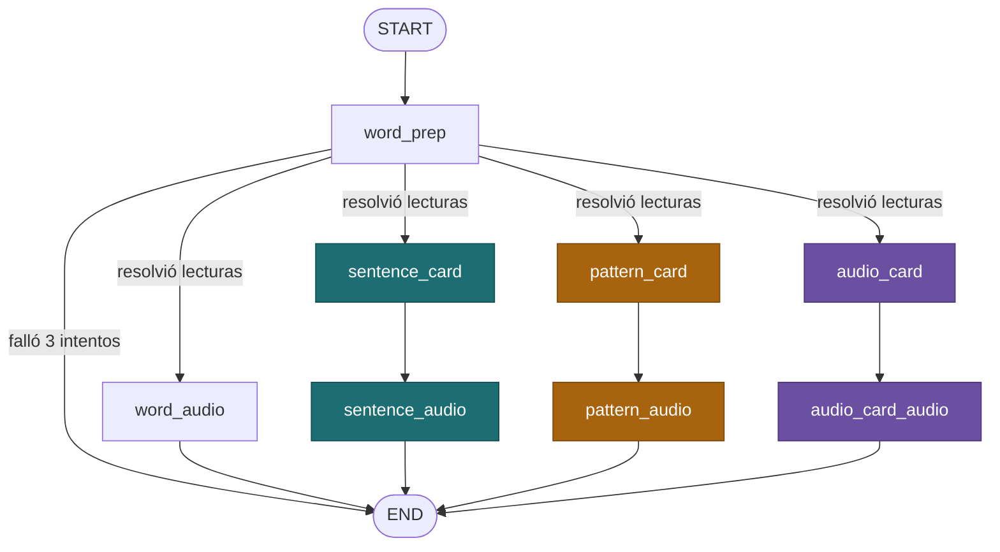

# ChinoSRS — Sistema de Repetición Espaciada para Chino

Pipeline que genera mazos de Anki para vocabulario HSK: cada palabra produce 3 tipos de tarjeta (oración en contexto, cloze y comprensión auditiva), con contenido revisado por un LLM contra guardrails de calidad y audio generado con alineación por carácter para resaltado sincronizado.

---

## Arquitectura

- **SQLite** (`outputs/chinosrs.db`) es la fuente de verdad: palabras, lecturas, tarjetas, ejemplos, audio y el historial de intentos de generación viven ahí. Anki solo recibe una copia exportada.
- **LangGraph** orquesta la generación por palabra: un grafo con checkpointer en SQLite, así se puede interrumpir y reanudar sin perder trabajo.
- **Guardrails**: cada tarjeta generada pasa por una verificación separada del LLM (pinyin, significado, gramática, que no se filtre la palabra compuesta en el hueco del cloze, etc.) antes de guardarse.
- **ElevenLabs TTS** genera el audio con alineación por carácter, usada para resaltar la palabra que se está reproduciendo en tiempo real.
- **AnkiConnect** exporta las tarjetas `ready` a un mazo y modelos de nota separados por nivel HSK.

### Grafo de generación (por palabra)



`word_prep` resuelve pinyin/significado (detectando polífonos) una sola vez por palabra; a partir de ahí, las 3 tarjetas se generan en paralelo, cada una con su propio guardrail y su propio nodo de audio.

---

## Requisitos

- **Python 3.10+**
- **Anki Desktop** con el add-on **AnkiConnect** (código: `2055492159`)
- **API key de OpenAI** (generación de texto)
- **API key de ElevenLabs** (audio)

---

## Instalación

```bash
git clone <repo-url>
cd ChinoSRS

python -m venv anki-venv
# Windows: anki-venv\Scripts\activate
# Linux/Mac: source anki-venv/bin/activate

pip install -r requirements.txt
```

Copia `.env.example` a `.env` y completa:
```bash
OPENAI_API_KEY=sk-...
ELEVEN_LABS_API_KEY=...
```

Instala AnkiConnect en Anki: Herramientas → Complementos → Obtener Complementos → código `2055492159` → reiniciar Anki.

---

## Uso rápido

```bash
python main.py load --input resources/complete.json   # siembra HSK3 en SQLite (default --hsk-level 3)
python main.py generate                                # corre el pipeline sobre lo pendiente
python main.py export --hsk-level 3                    # empuja lo 'ready' al mazo "ChinoSRS - HSK3"
```

El camino completo recomendado (con estimados reales de costo y de cuánto termina necesitando revisión manual) está en **[docs/GETTING_STARTED.md](docs/GETTING_STARTED.md)**. Todos los comandos están documentados en **[docs/CLI_CHEATSHEET.md](docs/CLI_CHEATSHEET.md)** (referencia rápida de sintaxis) y **[docs/WORKFLOWS.md](docs/WORKFLOWS.md)** (explicaciones y ejemplos: revisión manual con flags de Anki, casos difíciles de `needs_human`, auditoría de naturalidad, dashboard de estado, regeneración puntual).

---

## Tipos de tarjeta

Cada palabra genera las 3, cada una con su propio acento de color:

### 🀄 SentenceCard (teal)
Frente: oración de ejemplo con la palabra resaltada. Reverso: pinyin, significado, desglose palabra por palabra, colocaciones comunes, audio con resaltado sincronizado.

### 🧩 PatternCard (ámbar)
Frente: la misma oración con la palabra objetivo oculta como hueco (`＿＿`, ubicado por posición en el desglose, no por búsqueda de texto — así una palabra dentro de un compuesto no se ve afectada). 2 pistas progresivas. Sin audio.

### 🔊 AudioCard (violeta)
Frente: solo el audio de la oración (velocidad normal + lenta), sin texto. 2 pistas progresivas (revela primero el hanzi objetivo, luego el significado). Reverso: desglose completo con resaltado sincronizado en ambas velocidades.

---

## Flujo de revisión manual

Las tarjetas que fallan el guardrail automático quedan en `guardrail_failed` (no se reintentan solas — evita gasto indefinido en algo estructuralmente roto). Para las que se ven mal ya en Anki: se flaguean con el flag rojo nativo de Anki (Ctrl+1), se importan a SQLite, se regeneran, y se re-exportan — sin que eso afecte la programación de repaso de la tarjeta. Las que agotan el tope de reintentos (`needs_human`) suelen caer en cuatro categorías con su propia herramienta: significado primario mal clasificado pero ya registrado (`swap-primary`), significado dominante que ni siquiera estaba registrado (`add-reading`), lectura correcta ya registrada pero mal descrita (`edit-reading`), o palabra sin forma natural de aparecer sola (`manual-card`, oración escrita a mano + desglose vía LLM). Como el guardrail evalúa gramática/traducción pero no si una combinación suena forzada a un nativo, hay además una auditoría aparte (`audit-naturalness`) que revisa lo ya generado buscando ese patrón específico y lo marca `needs_human` directamente. Detalle completo en [WORKFLOWS.md](docs/WORKFLOWS.md).

---

## Estructura del proyecto

```
ChinoSRS/
├── main.py                        # Orquestador CLI (load/generate/export/flag-batch/regenerate/dashboard/clean-audio)
├── requirements.txt
├── .env                          # API keys (no se sube a git)
│
├── src/
│   ├── db/
│   │   ├── schema.sql             # Esquema SQLite
│   │   ├── database.py            # Conexión + migraciones
│   │   └── load_words.py          # Carga resources/complete.json -> SQLite
│   │
│   ├── llm/
│   │   └── client.py               # Cliente LLM agnóstico de proveedor
│   │
│   ├── generation/
│   │   ├── graph.py                # Grafo LangGraph + runner de batch
│   │   ├── word_prep.py            # Nodo: resuelve lecturas/colocaciones
│   │   ├── sentence_card.py        # Agente SentenceCard
│   │   ├── pattern_card.py         # Agente PatternCard
│   │   ├── audio_card.py           # Agente AudioCard
│   │   ├── card_common.py          # Piezas compartidas entre agentes
│   │   ├── guardrail.py            # Verificación LLM composable
│   │   ├── prompts.py              # Prompts + checks de guardrail
│   │   ├── audio_gen.py            # Generación/caché de audio TTS
│   │   ├── regenerate.py           # Regeneración puntual (flagged/guardrail_failed)
│   │   ├── manual_card.py          # Oración escrita a mano + desglose vía LLM
│   │   ├── manual_card_batch.py    # Corre manual_card sobre una lista en JSON
│   │   ├── swap_reading.py         # Promueve una lectura secundaria ya registrada a primaria
│   │   ├── add_reading.py          # Agrega una lectura que no estaba registrada
│   │   ├── edit_reading.py         # Corrige el texto de una lectura ya registrada
│   │   ├── unflag_card.py          # Quita el flag de review sin tocar el contenido (falsos positivos)
│   │   └── audit_naturalness.py    # Auditoría en lote: detecta usos forzados en palabras de 1 carácter
│   │
│   ├── audio/engines/
│   │   ├── elevenlabs_engine.py    # Motor TTS principal (con alineación)
│   │   └── gtts_engine.py          # Motor alterno
│   │
│   ├── anki/
│   │   ├── api.py                  # Wrapper de AnkiConnect
│   │   ├── models.py               # Note types por (tipo de tarjeta, nivel HSK)
│   │   ├── export.py               # Exportador SQLite -> Anki
│   │   └── review.py               # Importa flags de Anki a SQLite
│   │
│   ├── templates/                  # HTML/CSS de las 3 tarjetas (Front/Back/estilos)
│   │
│   └── utils/
│       ├── inspect_word.py         # Lecturas/tarjetas/últimos intentos de una palabra puntual
│       ├── dashboard.py            # Estado de la DB, guardrails, flags, audio huérfano
│       ├── clean_audio.py          # Limpieza de audio huérfano
│       ├── cost_tracker.py         # Costo real (tokens LLM + caracteres TTS) x precio de lista
│       ├── frequency.py            # rank -> bucket de frecuencia
│       └── dump_deck.py            # Respaldo de un mazo de Anki a JSON
│
├── docs/GETTING_STARTED.md         # Camino completo paso a paso, con estimados de costo/revisión manual
├── docs/CLI_CHEATSHEET.md          # Referencia rápida de sintaxis de todos los comandos
├── docs/WORKFLOWS.md               # Explicaciones y ejemplos de cada flujo/herramienta
├── resources/
│   ├── complete.json               # Vocabulario HSK fuente
│   └── audios/                     # Audio generado (fuera de git)
└── outputs/chinosrs.db             # Base SQLite (fuera de git)
```

---

## Datos incluidos

`resources/complete.json` trae el vocabulario HSK completo (ambos estándares, 2010 y 2021), **11,494 entradas** en total. El pipeline hoy solo genera **HSK3** (964 palabras del estándar 2021) — `load` filtra por nivel con `--hsk-level` (default 3; `--hsk-level 0` carga todo sin filtrar).

**Fuente**: [Complete HSK Vocabulary](https://github.com/drkameleon/complete-hsk-vocabulary)

---

## Autor

**Juan Montero**

Creado con asistencia de IA generativa (Claude Code).

---

## Contribuciones

¡Las contribuciones son bienvenidas! Abre un issue o PR.

## Soporte

Para preguntas o problemas, abre un issue en GitHub.
