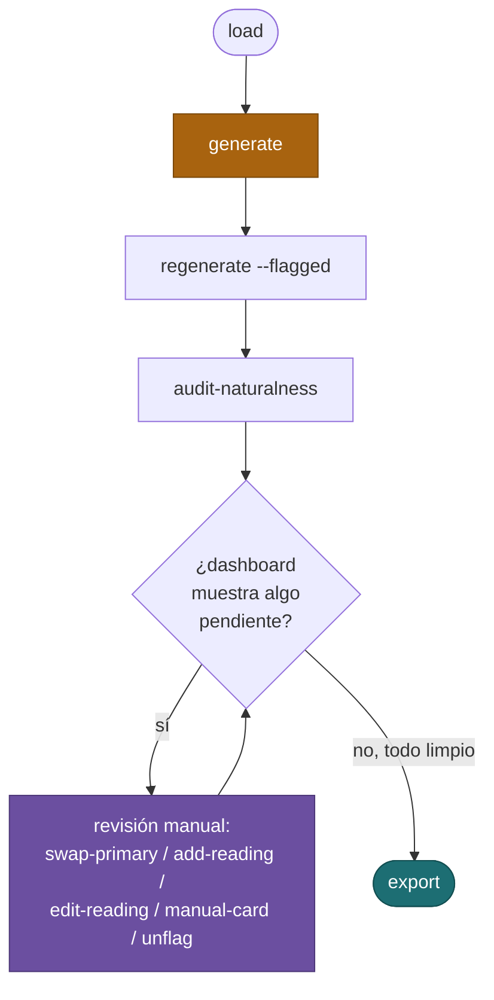
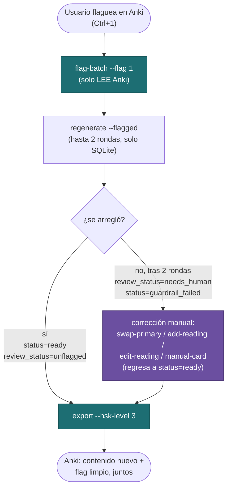

# ChinoSRS — guía de inicio: de cero a un mazo limpio

Camino recomendado desde el JSON fuente hasta un mazo limpio en Anki. Para sintaxis exacta de cada comando ver **[CLI_CHEATSHEET.md](CLI_CHEATSHEET.md)**; para explicación de cuándo usar cada herramienta, **[WORKFLOWS.md](WORKFLOWS.md)**.

## Resumen

El "happy path" es `load` → `generate` → `export`, pero en la práctica **siempre** hay una vuelta de corrección entre `generate` y `export` — el guardrail automático no deja pasar todo a la primera, y hay un patrón de "suena forzado mas no es agramatical" que ese guardrail no detecta en absoluto. Las secciones de abajo van en el orden en que de verdad conviene correrlas.



`generate` (naranja) es el paso caro — ver sección 2. La revisión manual (morado) es el único ciclo que se repite hasta que el dashboard queda limpio.

---

## 1. `load` — JSON fuente → SQLite

```
load --input resources/complete.json [--hsk-level 3]
```

Siembra las palabras del nivel elegido en SQLite. Rápido, sin costo (no llama a ningún LLM), idempotente.

---

## 2. `generate` — el paso más costoso y lento

```
generate [--limit N]
```

Este es, con diferencia, el paso más caro y más lento de todo el pipeline. Por cada palabra corre:
- `word_prep` (resuelve lecturas/polífonos, 1+ llamadas LLM),
- 3 tarjetas en paralelo (sentence/pattern/audio), cada una con su propio ciclo generación+guardrail (2 llamadas LLM por intento, hasta 3 intentos automáticos si falla),
- audio TTS (ElevenLabs) por cada tarjeta que sí pasó.

**Estimado de costo para 1000 palabras (~3000 tarjetas)**, con el default actual (`LLM_GENERATION_MODEL=gpt-4o`, `LLM_GUARDRAIL_MODEL=gpt-4o-mini` — el guardrail es una tarea de verificación, no de creación, así que no necesita el modelo caro):

- Medido en vivo esta sesión: regenerar las 3 tarjetas de una palabra ya con `word_prep` resuelto (`较`, con el guardrail ya en `gpt-4o-mini`) costó **$0.0211** (6 llamadas LLM: 1 generación gpt-4o + 1 guardrail gpt-4o-mini por tarjeta). Con el guardrail antes en gpt-4o, la misma operación costaba **$0.0422** (medido también en vivo sobre 所/架/较/顿) — justo la mitad, porque el guardrail rondaba la mitad del costo por tarjeta y gpt-4o-mini es ~17x más barato por token.
- Sumando un estimado de `word_prep` (proporcionalmente más barato por la misma razón — antes ~$0.008/palabra con guardrail en gpt-4o, ahora ~$0.004), el total ronda **~$0.025 por palabra, es decir ~$25 por 1000 palabras (~3000 tarjetas)**.
- Es un piso, no un promedio garantizado: cada intento de guardrail que falla se vuelve a cobrar (hasta 3 rondas automáticas por tarjeta), así que un batch con más fricción cuesta más. El costo real de cualquier corrida lo imprime el mismo comando al terminar (`Costo estimado: $X · LLM $Y (N llamadas) · ElevenLabs $Z`) — no hace falta estimarlo a ciegas, esa cifra es del tracker real (que calcula el costo LLM por el modelo real usado en cada llamada, no una tarifa fija), no una proyección.

ElevenLabs (TTS) es una fracción menor del total (~15-25% con el guardrail ya barato) — el grueso sigue siendo LLM por `LLM_GENERATION_MODEL`. Si además se necesitara abaratar la generación, `LLM_GENERATION_MODEL` en `.env` acepta cualquier modelo, aunque ahí sí hay más riesgo de perder calidad de redacción.

Deja quietas a propósito las tarjetas que agotan sus 3 intentos automáticos en `status='guardrail_failed'` — no las reintenta sola indefinidamente. Interrumpible (Ctrl+C) y resumible.

---

## 3. `regenerate --flagged` — segunda vuelta a lo que falló solo

```
regenerate --flagged [--hsk-level 3]
```

Antes de exportar nada, conviene correr esto: reintenta tanto las palabras atascadas en `word_prep` como las tarjetas en `guardrail_failed`, hasta `REGEN_ATTEMPTS_CAP` (2) rondas más. Si una tarjeta sigue fallando tras esas rondas extra, escala a `review_status='needs_human'` y deja de reintentarse sola — a partir de ahí necesita una de las herramientas de corrección (ver WORKFLOWS.md, sección "Casos difíciles").

En el batch de referencia de esta sesión (1135 palabras / 3405 tarjetas HSK3), **7 tarjetas** terminaron escalando a `needs_human` por esta vía — **~0.2%**, o **~2 tarjetas por cada 1000**.

---

## 4. `audit-naturalness` — el patrón que el guardrail no ve

```
audit-naturalness [--hsk-level N] [--batch-size 15]
```

El guardrail evalúa gramática/traducción, pero no si una oración *técnicamente correcta* suena forzada a un hablante nativo — el patrón encontrado en 报/保: la palabra usada como verbo/sustantivo genérico con un objeto libre, cuando el uso real casi siempre pide un compuesto fijo (汇报, 报警, 保护...). Este problema es casi exclusivo de palabras de **1 solo carácter**, así que el audit se limita a esas.

En el mismo batch de referencia, de 466 tarjetas candidatas (palabras de 1 carácter, `ready`/`llm`), **30 salieron marcadas** — **~6.4% de las tarjetas de palabras de 1 carácter**, que traducido al total de la baraja (las palabras de 1 carácter son ~14% del vocabulario) equivale a **~9 tarjetas por cada 1000** del total.

**⚠️ No es infalible — da falsos positivos.** Durante esta misma revisión, 2 de las 30 marcadas resultaron estar bien (misma construcción gramatical que una tarjeta hermana que sí había pasado). **Siempre revisar a mano antes de corregir** — nunca aplicar una corrección solo porque el audit la marcó. Si al revisar resulta que estaba bien, usar `unflag` (limpia el flag sin tocar el contenido).

Combinando las dos vías (`regenerate --flagged` agotado + `audit-naturalness`), en este batch terminaron necesitando alguna forma de revisión manual **~37 de 3405 tarjetas — ~1.1%, o ~11 por cada 1000**.

---

## 5. Revisión manual — hasta dejarlo limpio

Con lo que salió marcado (de cualquiera de las dos vías de arriba), revisar palabra por palabra con `inspect-word` y aplicar la herramienta que corresponda según la causa real (detalle completo en WORKFLOWS.md):

- `swap-primary` — el sentido correcto ya estaba registrado como secundaria.
- `add-reading` — el sentido correcto no estaba registrado en absoluto.
- `edit-reading` — el sentido correcto ya estaba registrado pero mal descrito.
- `manual-card` / `manual-card-batch` — la palabra no tiene forma natural de aparecer sola; se escribe la oración a mano.
- `unflag` — falso positivo del audit, no hacía falta ningún cambio.

Repetir `dashboard` para confirmar que las tablas de "fallando guardrails" y "flaggeadas/escaladas" queden vacías antes de exportar.

---

## 6. `export`

```
export --hsk-level 3
```

Recién acá se sube todo a Anki. Solo toma tarjetas `status='ready'` — cualquiera que siga en `guardrail_failed`/`needs_human` queda excluida hasta que se corrija (ver más abajo).

---

## Ciclo de revisión ya en Anki (flags nativos)

Una vez exportado, el usuario revisa las tarjetas ya en Anki y flaguea las que ve mal con el flag rojo nativo (**Ctrl+1**). El flujo completo, paso a paso:



1. **Flaguear en Anki** (Ctrl+1, flag rojo — solo este color, la convención de este flujo).
2. **`flag-batch --flag 1`** — lee el flag de Anki, marca `review_status='flagged_bad'` en SQLite. Nunca escribe en Anki.
3. **`regenerate --flagged`** — reintenta automáticamente (hasta 2 rondas). Solo toca SQLite. Dos desenlaces posibles:
   - **Se arregla sola** → `status='ready'`, `review_status='unflagged'`. Se pasa directo al paso 5.
   - **Sigue fallando** → escala a `review_status='needs_human'`, `status='guardrail_failed'`. Hace falta el paso 4.
4. **Corrección manual** (solo si escaló a `needs_human`) — `inspect-word` para diagnosticar la causa, luego `swap-primary`/`add-reading`/`edit-reading`/`manual-card` según corresponda (ver WORKFLOWS.md). Esto regresa la tarjeta a `status='ready'`.
5. **`export --hsk-level 3`** — el único paso que de verdad habla con Anki en todo este ciclo: sube el contenido nuevo Y limpia el flag rojo, **juntos, nunca por separado** (para no dejar contenido corregido con el flag todavía puesto, ni un flag limpio sobre contenido que sigue mal).

**Import­ante**: `export` hace falta **siempre** al final, sea que `regenerate --flagged` la haya resuelto sola (paso 3) o que haya hecho falta corregirla a mano (paso 4) — ni `regenerate` ni las herramientas de corrección hablan con Anki, solo tocan SQLite.

**¿Y si sigue en `needs_human`? ¿Cuándo se limpia el flag rojo en Anki?** No hasta que se corrija. `export` solo toma tarjetas con `status='ready'`, así que mientras la tarjeta siga en `guardrail_failed`/`needs_human`, la nota en Anki se queda exactamente como estaba: mismo contenido viejo, mismo flag rojo — no hace falta ningún paso especial para eso, simplemente `export` no la va a tocar todavía. `dashboard` (tabla "Flaggeadas / escaladas") o `inspect-word --word <hanzi>` dicen en qué punto quedó cada una.
